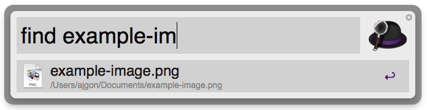
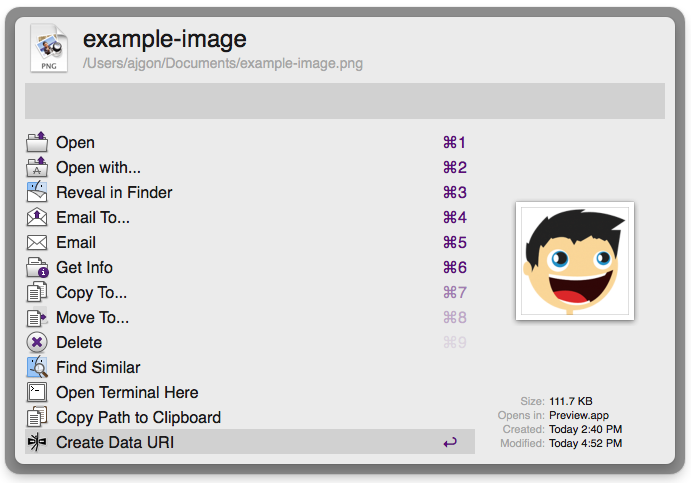
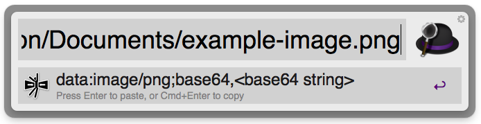

Data URI scheme for Alfred 2
============

A simple Alfred 2 file to Data URI converter. Includes image optimization via excellent [ImageOptim-CLI](https://github.com/JamieMason/ImageOptim-CLI) shell script and [svgo](https://github.com/svg/svgo) nodejs library.

Installation
----------------

- Download "[DataURIscheme.alfredworkflow](https://github.com/ajgon/alfred2-datauri/blob/master/DataURIscheme.alfredworkflow?raw=true)" extension.
- Double click the downloaded "DataURIscheme.alfredworkflow" file to install. **Alfred 2 is required**
- If you like **svgo** optimization support, please install nodejs `brew install node`

Instructions
----------------

- Find file

- Press Right Arrow to open file actions menu, and select "Create Data URI"

- After scheme is generated, press enter to paste it to currently opened application, or Cmd+Enter to copy it to clipboard

